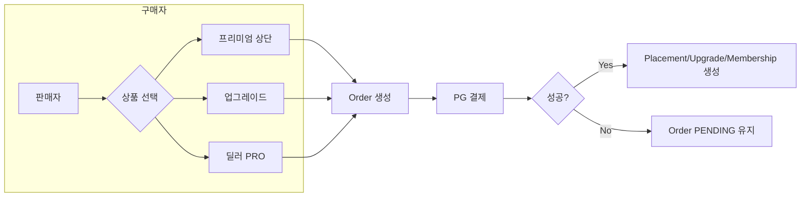
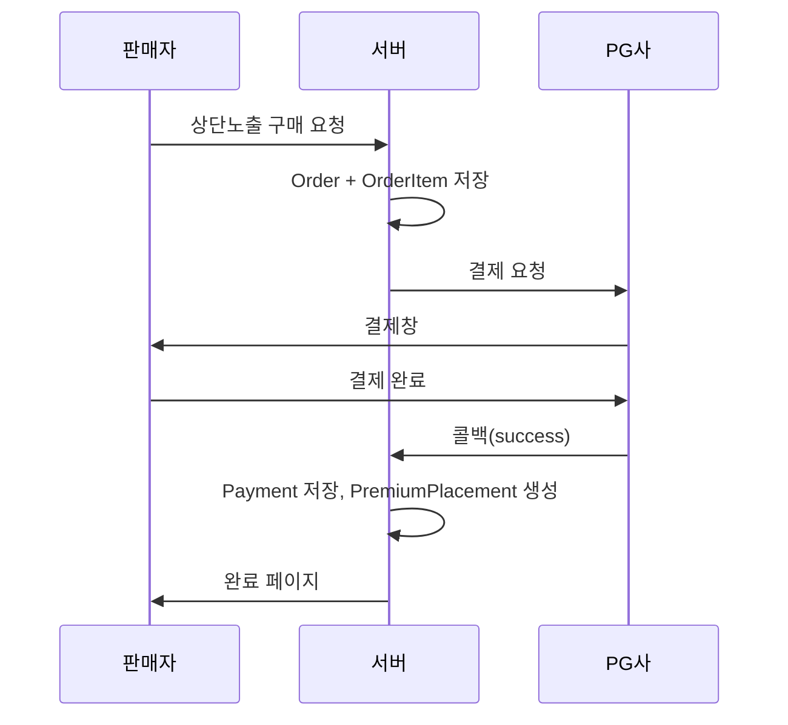

# 굴삭기나라 플랫폼 유료화 기획서

**작성일:** 2026-02  
**현황:** 일 방문자 약 20,000명, 무료 등록/무료 열람  
**목표:** 트래픽 유지 + 판매자 중심 유료화

---

## 목차
1. [유료화 전략 상세](#1-유료화-전략-상세)
2. [DB 설계](#2-db-설계)
3. [노출 우선순위 및 알고리즘](#3-노출-우선순위-및-알고리즘)
4. [기능 흐름도](#4-기능-흐름도)
5. [관리자 기능](#5-관리자-기능)
6. [자동 만료/갱신 및 PG 연동](#6-자동-만료갱신-및-pg-연동)
7. [트래픽 유지 전략](#7-트래픽-유지-전략)
8. [수익 시뮬레이션](#8-수익-시뮬레이션)

---

## 1. 유료화 전략 상세

### 1.1 프리미엄 상단 노출 상품

| 항목 | 내용 |
|------|------|
| **노출 위치** | ① 카테고리 상단 고정 ② 지역 상단 고정 ③ 검색결과 상단(조건 일치 시) |
| **노출 기간** | 7일 / 30일 (구매 시 선택) |
| **자동 재노출** | 만료 N일 전 알림 → 사용자가 연장 결제 시 동일 슬롯 유지 옵션 |
| **가격 예시** | 7일 19,000원 / 30일 49,000원 (카테고리 기준, 지역/검색은 별도 또는 패키지) |
| **제한** | 동일 매물당 1개 슬롯 타입별 1개 (카테고리 OR 지역 OR 검색 중 동시 다중 구매 가능) |

**비즈니스 로직**
- 슬롯 타입: `CATEGORY_TOP` | `REGION_TOP` | `SEARCH_MATCH`
- `SEARCH_TOP`은 사용하지 않는다(무조건 상단 고정 노출 금지).
- 검색 상단은 카테고리+지역 필수 + 키워드(선택) 조건이 일치할 때만 노출.
- 해당 타입 내에서 `paid_at` ASC(공정 정렬) → 유료 슬롯을 먼저 노출 후 무료 매물

---

### 1.2 판매글 업그레이드 상품

| 구분 | 무료 | 유료 업그레이드 |
|------|------|------------------|
| **사진** | 5장, 30일 유지 | 20장 |
| **유지 기간** | 30일 후 비공개/삭제 안내 | 60일 또는 PRO 시 무제한 |
| **강조 표시** | 없음 | 카드 테두리/뱃지 "프리미엄" |
| **상단 재노출** | 없음 | 주기적 상단 재노출(예: 24시간마다 1회 상단 노출) |

**가격 예시:** 1회성 9,900원 (30일 강조+사진 20장+재노출)

---

### 1.3 딜러 PRO 멤버십

| 혜택 | 내용 |
|------|------|
| 매물 등록 | 무제한 |
| 업체 상호 노출 | 목록/상세에서 "PRO 딜러" 뱃지 + 상호명 강조 |
| 연락처 강조 | 상세 페이지 내 연락처 영역 강조 |
| 브랜드관 페이지 | 전용 URL 예: `/dealer/{username}/` |
| 조회 통계 | 내 매물별 조회수, 문의 수(선택) |
| 결제 구조 | 월 정액 (예: 29,000원/월, 연 결제 시 10% 할인) |

**DB 반영**
- `Profile.user_type == 'DEALER'` + `DealerMembership.is_active == True` → PRO 혜택 적용
- 만료일(`period_end`) 관리, 갱신 시 자동 결제 또는 수동 연장

---

## 2. DB 설계

### 2.1 ER 개요

```
[User] 1----* [Equipment]
  |              |
  |              *----[EquipmentImage]
  |              *----[PremiumPlacement]  (상단 노출 슬롯)
  |              *----[EquipmentUpgrade]  (업그레이드: 사진/강조/재노출)
  |
  *----[DealerMembership]   (딜러 PRO)
  *----[Order]              (주문)
          *----[OrderItem]   (주문 항목: 어떤 상품을 얼마에)
  *----[Payment]            (결제: PG 응답 저장)

[Product] (요금제 마스터)
  *----[OrderItem]
```

### 2.2 요금제 테이블 (Product)

| 필드 | 타입 | 설명 |
|------|------|------|
| id | PK | |
| code | VARCHAR(32) UNIQUE | 예: `PREMIUM_TOP_7D`, `UPGRADE_LISTING`, `DEALER_PRO_MONTHLY` |
| name | VARCHAR(100) | 상품명 (노출용) |
| product_type | VARCHAR(20) | `PREMIUM_TOP` / `LISTING_UPGRADE` / `DEALER_MEMBERSHIP` |
| slot_type | VARCHAR(20) NULL | PREMIUM_TOP일 때만: `CATEGORY_TOP` / `REGION_TOP` / `SEARCH_TOP` |
| duration_days | INT NULL | 유효 일수 (멤버십은 30) |
| price | DECIMAL(10,2) | 판매가 |
| is_recurring | BOOLEAN | 정기 결제 여부 (멤버십) |
| is_active | BOOLEAN | 판매 여부 |
| sort_order | INT | 관리자 화면 정렬 |
| created_at, updated_at | TIMESTAMP | |

### 2.3 결제/주문 테이블

**Order (주문)**

| 필드 | 타입 | 설명 |
|------|------|------|
| id | PK | |
| user_id | FK(User) | 구매자 |
| order_number | VARCHAR(32) UNIQUE | 주문번호 (예: ORD202602280001) |
| status | VARCHAR(20) | `PENDING` / `PAID` / `CANCELLED` / `REFUNDED` |
| total_amount | DECIMAL(10,2) | 총 결제 금액 |
| created_at, updated_at | TIMESTAMP | |

**OrderItem (주문 항목)**

| 필드 | 타입 | 설명 |
|------|------|------|
| id | PK | |
| order_id | FK(Order) | |
| product_id | FK(Product) | |
| quantity | INT | 기본 1 |
| unit_price | DECIMAL(10,2) | 구매 시점 단가 |
| target_content_type | FK(ContentType) NULL | 적용 대상 (Equipment 등) |
| target_object_id | BIGINT NULL | 적용 대상 PK |
| slot_type | VARCHAR(20) NULL | 상단 노출 시 타입 |
| starts_at | TIMESTAMP NULL | 유효 시작 |
| expires_at | TIMESTAMP NULL | 유효 만료 |
| metadata | JSONB NULL | 확장용 (예: 카테고리/지역 코드) |

**Payment (결제)**

| 필드 | 타입 | 설명 |
|------|------|------|
| id | PK | |
| order_id | FK(Order) | |
| pg_provider | VARCHAR(20) | `tosspay` / `inicis` / `kakao` 등 |
| pg_tid | VARCHAR(100) | PG 거래 ID |
| amount | DECIMAL(10,2) | 실제 결제 금액 |
| status | VARCHAR(20) | `REQUESTED` / `SUCCESS` / `FAILED` / `CANCELLED` |
| requested_at, paid_at | TIMESTAMP | |
| raw_response | JSONB NULL | PG 응답 원문 (디버깅/분쟁) |

### 2.4 프리미엄 상단 노출

**PremiumPlacement** (실제 노출 제어용 뷰/캐시 테이블)

| 필드 | 타입 | 설명 |
|------|------|------|
| id | PK | |
| equipment_id | FK(Equipment) | |
| slot_type | VARCHAR(20) | CATEGORY_TOP / REGION_TOP / SEARCH_TOP |
| category | VARCHAR(50) NULL | slot_type이 CATEGORY_TOP일 때 |
| region_key | VARCHAR(50) NULL | slot_type이 REGION_TOP일 때 (정규화된 지역) |
| order_item_id | FK(OrderItem) | 어느 결제에서 왔는지 |
| starts_at | TIMESTAMP | |
| expires_at | TIMESTAMP | |
| auto_renewable | BOOLEAN | 자동 연장 대상 여부 |
| created_at | TIMESTAMP | |

- 인덱스: `(slot_type, expires_at)`, `(slot_type, category, expires_at)`, `(slot_type, region_key, expires_at)`

### 2.5 판매글 업그레이드

**EquipmentUpgrade** (매물별 업그레이드 상태)

| 필드 | 타입 | 설명 |
|------|------|------|
| id | PK | |
| equipment_id | FK(Equipment) | |
| order_item_id | FK(OrderItem) | |
| max_images | INT | 20 |
| is_highlight | BOOLEAN | 강조 표시 |
| bump_at | TIMESTAMP NULL | 마지막 상단 재노출 시점 (재노출 주기 계산용) |
| expires_at | TIMESTAMP | |

### 2.6 딜러 PRO 멤버십

**DealerMembership**

| 필드 | 타입 | 설명 |
|------|------|------|
| id | PK | |
| user_id | FK(User) UNIQUE | 1 user 1 멤버십 |
| order_item_id | FK(OrderItem) NULL | 현재 구독의 주문 항목 |
| period_start | DATE | 현재 구독 시작일 |
| period_end | DATE | 현재 구독 만료일 |
| is_auto_renew | BOOLEAN | 자동 갱신 여부 |
| created_at, updated_at | TIMESTAMP | |

---

## 3. 노출 우선순위 및 알고리즘

### 3.1 카테고리/지역/검색 목록 노출 순서

```
1. [프리미엄 상단] 해당 슬롯 타입 + 카테고리(또는 지역/검색 조건) 일치
   → **현재 정책(V2): paid_at ASC (먼저 결제한 사람 우선, 공정).** 구 문서의 expires_at DESC는 사용하지 않음.
   → 동일하면 id ASC

2. [업그레이드 재노출] EquipmentUpgrade 존재 + bump_at이 N시간 이내
   → bump_at DESC

3. [딜러 PRO 매물] DealerMembership 활성 사용자 매물
   → created_at DESC (최신순)

4. [일반 무료/유료] 나머지
   → created_at DESC (최신순)
```

### 3.2 무료/유료 비율 (권장)

- **상단 슬롯:** 카테고리별 상단 3~5칸을 프리미엄 전용. 나머지 영역은 2번~4번 혼합.
- **목록 비율:** 전체 목록에서 **유료(프리미엄+업그레이드+PRO) : 무료 ≈ 2 : 8 ~ 3 : 7** 유지 권장.  
  (무료 비중이 너무 줄면 이탈 가능성 증가)

### 3.3 검색 결과 상단 (V2: SEARCH_MATCH)

- `SEARCH_TOP`은 사용하지 않는다(무조건 상단 고정 노출 금지). 
- 검색 상단 노출은 `SEARCH_MATCH`만 허용. 조건: category·region_key 필수, match_keywords 선택. 정렬: `order_by('paid_at', 'id')`. 키워드 매칭: DB 후보 → 파이썬 normalize 필터링, 성능 이슈 시 JSON(GIN) 고도화.

---

## 4. 기능 흐름도

### 4.0 흐름도 (Mermaid)





### 4.1 프리미엄 상단 노출 구매

**결제 성공 시 (CATEGORY_TOP: 대기열 정책)**

- PremiumPlacement 생성: `slot_no=NULL`, `status=WAITING`, `paid_at=Payment.paid_at`
- `starts_at` / `expires_at`는 슬롯 배정 전까지 미확정(또는 NULL)

**슬롯 배정 시(승격)**

- `slot_no` 부여
- `starts_at=now`, `expires_at=now+duration_days`
- `status=ACTIVE`

**REGION_TOP**은 대기열 정책이 없으므로, 결제 성공 즉시 `status=ACTIVE`로 `starts_at` / `expires_at` 세팅해도 된다.

```
[판매자] 매물 상세 → "상단 노출하기" 클릭
    → [상품 선택] 7일/30일, 슬롯 타입(카테고리/지역/검색)
    → [장바구니/결제] Order 생성, OrderItem 생성 (target=Equipment, slot_type, duration)
    → [PG 결제] Payment 요청 → 성공 시 status=PAID
    → [결제 완료 처리]
        - PremiumPlacement 생성 (위 정책: CATEGORY_TOP은 WAITING+기간 미확정, REGION_TOP은 즉시 ACTIVE+기간 세팅)
        - Order.status = PAID
    → [리다이렉트] "상단 노출이 적용되었습니다"
```

### 4.2 판매글 업그레이드 구매

```
[판매자] 매물 수정 페이지 또는 상세 → "업그레이드(사진 20장+강조)"
    → Product(LISTING_UPGRADE) 선택 → Order/OrderItem (target=Equipment)
    → PG 결제 → 성공 시 EquipmentUpgrade 생성 (max_images=20, is_highlight=True, expires_at)
    → Equipment 이미지 개수 제한 해제(20장까지), 목록에서 강조 스타일 적용
```

### 4.3 딜러 PRO 가입/갱신

```
[사용자] 마이페이지 또는 전용 랜딩 → "딜러 PRO 신청"
    → Product(DEALER_MEMBERSHIP, 월/연) 선택 → Order/OrderItem
    → PG 결제(정기결제 또는 1회)
    → 성공 시 DealerMembership 생성/갱신 (period_start, period_end, is_auto_renew)
    → Profile.user_type = DEALER (없으면 업데이트)
```

### 4.4 자동 재노출(업그레이드)

- Celery/크론: 매일 또는 6시간마다
  - `EquipmentUpgrade` 중 `is_highlight=True`, `expires_at > now`, `bump_at < now - 24h` 조회
  - 해당 매물의 `bump_at` 갱신 → 목록 정렬 시 “재노출” 영역에 일시 노출

### 4.5 자동 만료 처리

- Celery/크론: 일 1회
  - `PremiumPlacement.expires_at < now` → 해당 레코드 비활성(삭제 또는 is_active=False)
  - `EquipmentUpgrade.expires_at < now` → 강조/20장 해제(레코드 유지, 플래그만 만료 처리)
  - `DealerMembership.period_end < today` → is_active=False 또는 별도 플래그로 PRO 해제
  - 만료 N일 전 알림: 이메일/알림 테이블에 "상단노출/멤버십 만료 예정" 메시지

---

## 5. 관리자 기능

### 5.1 요금제(Product) 관리

- CRUD, 정렬, 활성/비활성
- 가격 변경 시 기존 주문에는 영향 없음(OrderItem에 단가 스냅샷)

### 5.2 주문/결제 조회

- Order 목록: 기간, 사용자, 상태 필터, 주문번호 검색
- Order 상세: OrderItem, Payment, PG TID 링크
- 결제 취소/부분 환불 시 상태 변경 및 PremiumPlacement/DealerMembership 반영

### 5.3 프리미엄 노출 관리

- PremiumPlacement 목록: 슬롯 타입, 매물, 만료일, 연장 이력
- 수동 추가/연장(이벤트용): 관리자가 무료로 슬롯 기간 연장

### 5.4 딜러 PRO 관리

- DealerMembership 목록: 사용자, 기간, 자동갱신 여부
- 수동 연장, 강제 해지

### 5.5 수익 대시보드

- 일/주/월 매출 집계 (Order.status=PAID 기준)
- 상품별 매출, 전환율(결제 완료/주문 생성)

### 5.6 알림/만료 관리

- 만료 예정 목록 (N일 이내)
- 자동 발송 이메일 로그 조회

---

## 6. 자동 만료/갱신 및 PG 연동

### 6.1 자동 만료

- **크론/Celery 태스크:** `expires_at` 지난 PremiumPlacement, EquipmentUpgrade 만료 처리
- **DealerMembership:** `period_end` 경과 시 PRO 해제, 알림 발송

### 6.2 자동 갱신(선택)

- 정기결제 PG 사용 시: 결제일+30일에 PG에 재결제 요청
- 성공 시: 동일 Product로 Order/OrderItem 생성, DealerMembership.period_end += 30일
- 실패 시: 재시도 정책(3일 후 등), 실패 시 is_auto_renew=False 및 알림

### 6.3 PG 연동 구조 예시 (Django)

```
billing/
  services/
    pg_tosspay.py   # 토스페이먼츠 요청/콜백
    pg_common.py    # 공통: Order 생성, Payment 저장, 성공 시 Placement/Upgrade/Membership 생성
  views.py          # 결제 요청 뷰, PG 콜백(성공/실패) 뷰
  urls.py           # /billing/checkout/, /billing/callback/tosspay/
```

- 결제 요청: Order 저장 → PG 결제 페이지 URL 생성 → redirect
- 콜백: PG에서 보낸 signature 검증 → Payment 저장 → 주문 상태 업데이트 → 서비스 레이어에서 Placement/Upgrade/Membership 생성

---

## 7. 트래픽 유지 전략

### 7.1 무료 이용자 이탈 방지

- **무료 한도 유지:** 사진 5장, 30일 유지. 기존과 동일하게 유지.
- **목록 비율:** 유료:무료 ≈ 2:8 ~ 3:7. 상단 3~5칸만 프리미엄, 나머지는 무료 매물이 충분히 보이도록.
- **검색/필터:** 무료 사용자도 동일한 검색·필터 사용 가능. 결과만 정렬에서 유료가 위로 올 뿐.
- **가격 인지:** "상단 노출", "업그레이드"를 "선택 옵션"으로 노출하고, 기본 경험은 기존과 동일 유지.

### 7.2 UX 변경 시 주의사항

- 기존 "무료 등록" 버튼/플로우 유지. 유료는 "더 많은 노출 원할 때" 선택.
- 첫 화면에서 유료 뱃지가 과하게 많지 않도록 상단 슬롯 개수 제한.
- 모바일/PC 동일 비율 정책 적용.
- A/B 테스트: 지역별/기기별로 유료 비율 다르게 두고 이탈률/체류시간 모니터링.

---

## 8. 수익 시뮬레이션

### 8.1 전환율 가정 (참고)

| 지표 | 보수적 | 중도 | 낙관 |
|------|--------|------|------|
| 방문자 중 매물 등록자 비율 | 0.5% | 1% | 2% |
| 등록자 중 유료 전환율 | 2% | 5% | 10% |
| PRO 전환율(등록자 대비) | 0.5% | 1% | 2% |

- 일 방문자 20,000명 → 등록자(가정) 200명/일 → 유료 전환 5% 시 10명/일

### 8.2 월 예상 매출 계산식

```
월 매출 =
  Σ (프리미엄 상단 판매 수 × 해당 상품 단가)
+ Σ (업그레이드 판매 수 × 단가)
+ (PRO 구독 수 × 월 정액)
+ (기타 상품)
```

**예시 (중도 가정)**  
- 프리미엄 7일: 100건/월 × 19,000 = 1,900,000  
- 프리미엄 30일: 30건/월 × 49,000 = 1,470,000  
- 업그레이드: 80건/월 × 9,900 = 792,000  
- PRO: 50명 × 29,000 = 1,450,000  
- **합계 약 561만 원/월** (가정에 따라 크게 변동)

### 8.3 시뮬레이션 구조 (코드/DB)

- **집계 테이블:** `RevenueDaily` (date, product_code, order_count, amount_sum)
- 크론: 일 단위로 Order(PAID) + OrderItem 집계하여 저장
- 대시보드: RevenueDaily 조회 + 전환율 지표(등록 수, 유료 전환 수)는 별도 로그/이벤트 테이블로 추적 권장

---

## 9. 확장성

- **Product:** 새 상품 타입 추가 시 `product_type`, `slot_type` 확장으로 대응.
- **OrderItem:** `target_content_type`/`target_object_id`로 Equipment 외 Part, JobPost 등에도 적용 가능.
- **PG:** `billing.services.pg_*` 추가로 여러 PG 병행 가능.
- **정기결제:** PG 정기결제 API 연동 시 `Payment`에 `is_recurring`, `parent_payment_id` 등 필드 확장.

---

## 10. Django 적용 방법

### 10.1 billing 앱 추가

```python
# config/settings.py
INSTALLED_APPS = [
    ...
    'billing',  # 유료화/결제
]
```

### 10.2 DB 마이그레이션 (PostgreSQL 권장)

```bash
python manage.py makemigrations billing
python manage.py migrate billing
```

### 10.3 URL/뷰 연결

- 결제 요청: `/billing/checkout/` (Order 생성 → PG redirect)
- PG 콜백: `/billing/callback/<pg_name>/` (Payment 저장 → Order 완료 처리 → Placement/Upgrade/Membership 생성)

### 10.4 목록 노출 적용

- `equipment.views.index` 등에서 `billing.services.exposure_ordering.get_ordered_equipment_ids()` 로 ID 순서 획득 후, 해당 순서로 매물 목록 렌더링.

---

이 문서와 프로젝트 내 `billing` 앱 모델을 기준으로 구현 순서를 정한 뒤, 단계별로 배포하는 것을 권장합니다.
